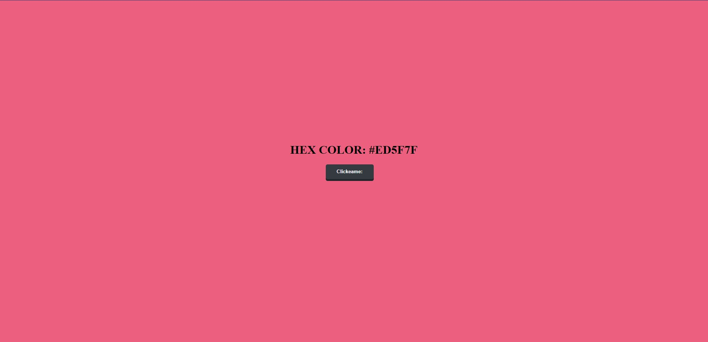

# HEXA Background

*In this project the challenges began, I proposed to randomly form a hexadecimal combination, where we would store that combination in a variable for that value to be read in the style of the body.*  

### I used

*   Css customization to be able to place a button in the center of the page.
*   Implementation of "for" function.
*   Array storing possible values 
*   Use of Math.random()

